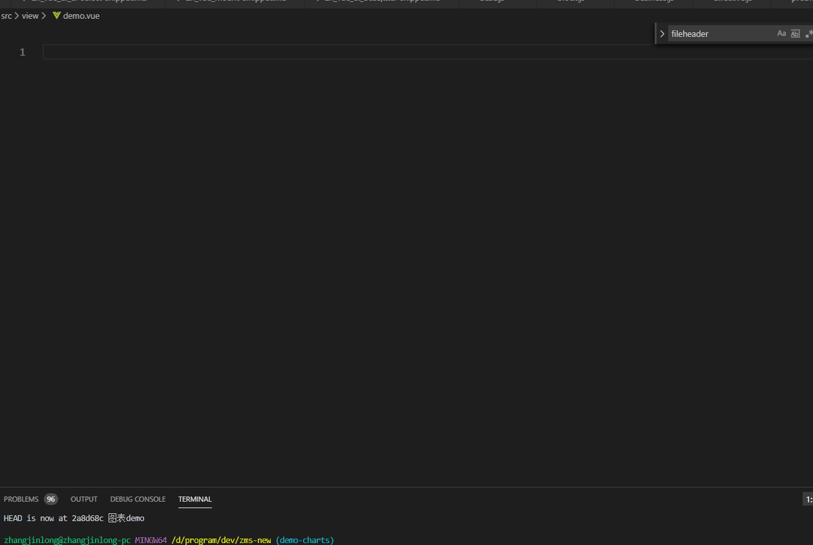

# vue生命周期片段 #
### 动效演示 ##

```html
<template>
<!--Created by CURRENT_USER  on 2019-11-21 20:54 -->
<div class="">
<!--主体内容区域-->
</div>
</template>
<script>
export default {
  props: {
    // 父组件传递过来的数据
    dialogVisible: {
      type: Boolean,
      default: false
    }
  },
  data () {
    return {
      code: '',
      params: {},
      tableList: [],
      flag: 1
    }
  },
  // 计算属性
  computed: {},
  // 监听属性
  watch () {},
  // 函数集，自己封装，便于开发使
  methods: {},
  // 要用到哪些子组件（如果组件已是最小粒度，那么可省略该属性）
  components: {},
  // 路由进入时使用
  beforeRouteEnter (to, from, next) {
    next(vm => {})
  },
  // 路由值变化时使用，如打开多个详情页
  beforeRouteUpdate  (to, from, next) {
    next()
  }
}
</script>
<style lang="less" scoped>
/*使用scss编写样式，既可提高开发效率，也方便维护*/
/*scoped省略后，该样式片段会应用到页面全局*/
</style>
```