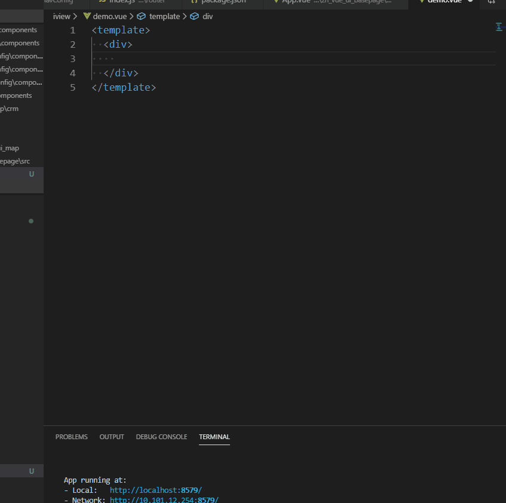

# 列表筛选组件片段 #
### 动效演示 ##

:::demo

```html
<template>
    <div id="app" class="znlhApp">

      <ZnBaseFilter 
          searchPlaceholder="请输入demo" 
          :filterParams="filterParams"
          @onFilterChange="filterChange">
      </ZnBaseFilter>

      <Divider />
      <div v-if="changeData">数据改变：{{ changeData }}</div>
      
      <Divider />
      <Button @click="handleClick">异步下拉数据</Button>
   </div>
</template>

<script>
export default {
    name: "app",
    data() {
        return {
            filterParams: [
              {
                name: "city", // 
                type: "select",
                placeholder: "请选择城市",
                list: [
                  {
                    city: "南京",
                    citycode: "32100"
                  },
                  {
                    city: "北京",
                    citycode: "12000"
                  }
                ], //select数据
                label: "city", // name
                value: "citycode", // key
                defaultValue: ""
              },
              {
                name: "userCode", // 
                type: "select",
                placeholder: "请选择",
                list: [], //select数据
                label: "name", // name
                value: "code", // key
                defaultValue: ""
              },
              {
                name: "customer", // 
                type: "cascader",
                placeholder: "请选择",
                list: [
                  {
                    value: "zhejiang",
                    label: "浙江",
                    children: [
                      {
                        value: "hangzhou",
                        label: "杭州",
                        children: [
                          {
                            value: "xihu",
                            label: "西湖",
                            code: 310000
                          }
                        ]
                      }
                    ]
                  },
                  {
                    value: "jiangsu",
                    label: "江苏",
                    children: [
                      {
                        value: "nanjing",
                        label: "南京",
                        children: [
                          {
                            value: "zhonghuamen",
                            label: "中华门",
                            code: 210000
                          }
                        ]
                      }
                    ]
                  }
                ], //select数据
                label: "label", // name
                value: "value", // key
                defaultValue: ""
              },
              {
                name: "date", //
                type: "datePicker",
                placeholder: "请选择",
                dateType: null,
                options: null
              }
            ],

            changeData:{},
            userList:[]

        };
    },
   methods: {
     filterChange(params){
        console.log(params);
        this.changeData = params;
     },

     handleClick(){
      //  this.filterParams[1].list.push()
       this.filterParams[1].list = [{
          name: "小张",
          code: "USER1001"
        },
        {
          name: "小明",
          code: "USER1002"
        }]
       }
   }
};
</script>

```
:::