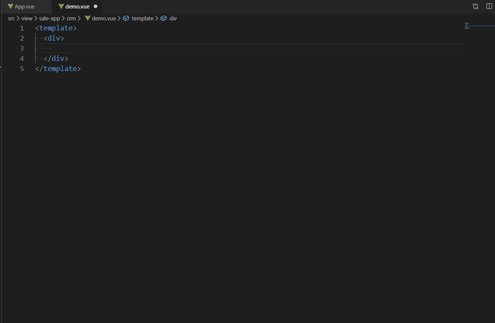

# 分页组件片段 #
### 动效演示 ##

:::demo

```html
<template>
  <div>
      <zn-base-page
        :totalRecords="totalRecords"
        :pageSize="pageSize"
        :pageNo="pageNo"
        :changePage="changePage"
        :showTotal="showTotal"
        :showElevator="showElevator"
        :showSizer="showSizer"
        :pageSizeOpts="pageSizeOpts"
        :onPageSizeChange="onPageSizeChange">
      </zn-base-page>
  </div>
</template>

<script>
export default {
  data () {
    return {
      totalRecords: 8,
      pageSize: 5,
      pageNo: 1,
      showTotal: true, // 显示文字
      showElevator: true, // 显示过滤控件
      pageSizeOpts: [2],
      showSizer: true
    }
  },
  methods: {
    changePage (e) {
      console.log('changePage--->', e)
    },
    onPageSizeChange (e) {
       console.log('onPageSizeChange--->', e)
    }
  }
}
</script>
```
:::