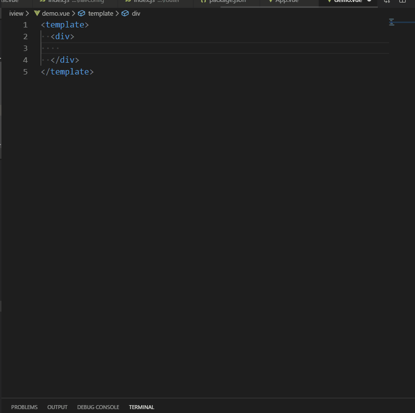

# 列表组件片段 #
### 动效演示 ##

:::demo

```html
<template>
  <div id="app" class="znlhApp">
      <zn-base-table
        :loading="tableParam.loading"
        :titles="tableParam.titles"
        :data="tableParam.data"
        :totalRecords="tableParam.totalRecords"
        :pageSize="tableParam.pageSize"
        :pageNo="tableParam.pageNo"
        @changePage="changePage"
        @onPageSizeChange="onPageSizeChange"
        @selectionChange="selectionChange"
        >
      </zn-base-table>
  </div>
</template>

<script>
export default {
  name: 'app',
  data () {
    return {
        message: '',
        tableParam: {
          loading: true,
          titles: [
              {
                  type: 'selection',
                  width: 40,
                  align: 'center'
              },
              {
                  title: '客户编号',
                  key: 'customerCode',
                  align: 'center',
                  width: 200,
                  sortable: true
              },
              {
                  title: '用户编号',
                  key: 'userCode',
                  align: 'center',
                  width: 200
              },
              {
                  title: '项目名称',
                  key: 'projectName',
                  align: 'center',
                  width: 200
              },
              {
                  title: '合作伙伴',
                  key: 'businessPartnerName',
                  align: 'center',
                  width: 120
              },
              {
                  title: '支付金额',
                  align: 'center',
                  key: 'payableAmount',
                  width: 100
              },
              {
                  title: '费用金额',
                  align: 'center',
                  width: 120
              },
              {
                  title: '结算状态',
                  key: 'confirmStatusStr',
                  align: 'center',
                  width: 120
              },
              {
                  title: '付款状态',
                  align: 'center',
                  key: 'settlementStatusStr',
                  width: 120
              },
              {
                  title: '创建时间',
                  key: 'addTimeStr',
                  align: 'center',
                  width: 180
              },
              {
                  title: '订单时间',
                  key: 'approvalBillNo',
                  align: 'center',
                  minWidth: 100
              },
              {
                  title: '操作',
                  key: 'action',
                  align: 'center',
                  fixed: 'right',
                  render: () => {
                      return <Button class="btn-primary">详情</Button>
                  },
                  width: 110
              }
          ],
          data: [],
          pageNo: 1,
          pageSize: 2,
          totalRecords: 3
      }
    }
  },
  mounted () {
    this.tableParam.loading = false
    this.tableParam.data = [
        {customerCode: 1001},
        {customerCode: 1002},
        {customerCode: 1003},
        {customerCode: 1004},
        {customerCode: 1005},
        {customerCode: 1006},
        {customerCode: 1007},
        {customerCode: 1001},
        {customerCode: 1002},
        {customerCode: 1003},
        {customerCode: 1004},
        {customerCode: 1005},
        {customerCode: 1006},
        {customerCode: 1007},
        {customerCode: 1001},
        {customerCode: 1002},
        {customerCode: 1003},
        {customerCode: 1004},
        {customerCode: 1005},
        {customerCode: 1006},
        {customerCode: 1007}
    ]
  },
  methods: {
      changePage () {

      },
      onPageSizeChange (e) {
         e
      },
      selectionChange () {

      },
      change () {
          this.message = '2018-05-27'
      }
  }
}
</script>

```
:::