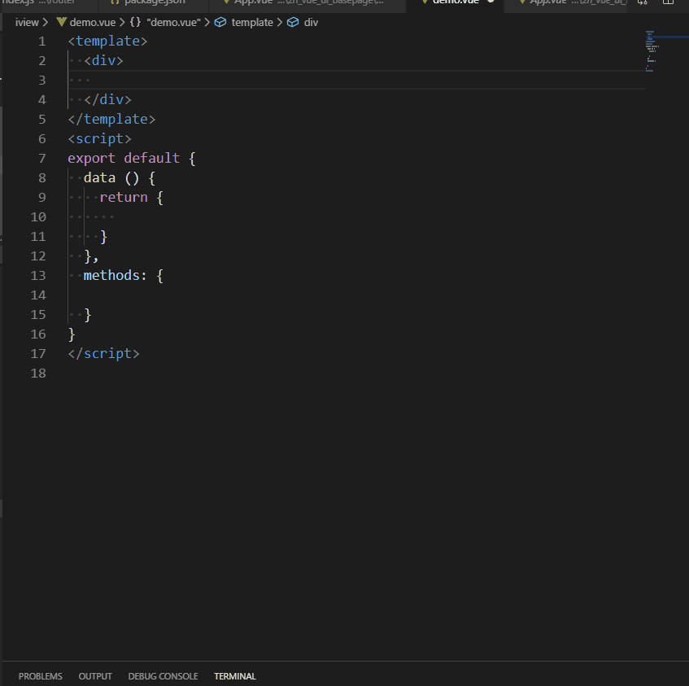

# 日历组件片段 #
### 动效演示 ##


:::demo

```html
<template>
  <div class="content">
    <div></div>
    <zn-calendar
      ref="Calendar"
      :markDateMore="markDateMore"
      v-on:isToday="clickToday"
      v-on:choseDay="clickDay"
      v-on:changeMonth="changeDate"
      v-on:mouseover="showTip"
      :sundayStart="true"
      :textTop="textTop"
      :showToolBar="true"
      :statusObject="statusObject"
      :selectedDate="selectedDate"
    ></zn-calendar>
    <br>
    <div class="div" style="color: red" @click="demo ">点击跳到2019-6-12</div>
  </div>
</template>

<script>
const STATUS = [
  { IS_ALL: 1, MARK_ALL: "mark1" },
  { IS_HALF: 2, MARK_HALF: "mark2" },
  { IS_ALL_STOP: 3, MARK_ALL_STOP: "mark3" },
  { IS_HALF_STOP: 4, MARK_HALF_STOP: "mark4" },
  { IS_WAIT: 5, MARK_WAIT: "mark5" },
  { ISNOT_WAIT: 6, MARK_NOT_WAIT: "mark6" }
];
export default {
  data() {
    return {
      markDateMore: [],
      textTop: ["日", "一", "二", "三", "四", "五", "六"],
      statusObject: {},
      selectedDate: new Date()
    };
  },
  methods: {
    clickDay(data) {
      this.$toast("选中了" + data);
    },
    clickToday(data) {
      // this.$toast("今天" + data);
    },
    changeDate(data) {
      this.$toast("切换到的月份为" + data);
    },
    demo() {
      this.selectedDate = new Date("2019-05-13")
    },
    showTip(e) {
      this.$toast("显示" + JSON.stringify(e));
    }
  },
  created() {
    let self = this
    let obj = {
      data: {
        statusObject: {
          allRent: 10,
          halfRent: 10,
          allStop: 10,
          halfStop: 10,
          waitRent: 20
        },
        list: [
          {
            devCode: "LWJAS060CJ0720666",
            date: "2019-06-12",
            status: 1,
            onAccHourStr: "10小时",
            workHourStr: "10小时"
          },
          {
            devCode: "LWJAS060CJ0720666",
            date: "2019-05-12",
            status: 2,
            onAccHourStr: "11小时",
            workHourStr: "12小时"
          },
          {
            devCode: "LWJAS060CJ0720666",
            date: "2019-04-12",
            status: 3,
            onAccHourStr: "13小时",
            workHourStr: "16小时"
          },
          {
            devCode: "LWJAS060CJ0720666",
            date: "2019-03-12",
            status: 4,
            onAccHourStr: "13小时",
            workHourStr: "18小时"
          },
          {
            devCode: "LWJAS060CJ0720666",
            date: "2019-02-22",
            status: 5,
            onAccHourStr: "13小时",
            workHourStr: "1小时"
          },
          {
            devCode: "LWJAS060CJ0720666",
            date: "2019-02-26",
            status: 6,
            onAccHourStr: "13小时",
            workHourStr: "4小时"
          }
        ]
      },
      message: "成功",
      errCode: 0,
      success: true
    };
    let list = obj.data.list;
    let statusList = obj.data.statusObject;
    // 图标展示集合
    this.statusObject = {
      title: "日出租情况",
      list: [
        { name: `全天在租 ${statusList.allRent}` },
        { name: `半天在租 ${statusList.halfRent}` },
        { name: `全天报停 ${statusList.allStop}` },
        { name: `半天报停 ${statusList.halfStop}` },
        { name: `待租 ${statusList.waitRent}` }
      ]
    };
    // 日历展示集合
    let arrStatus = [];
    list &&
      list.forEach((item, index) => {
        let currentStatus = STATUS[index];
        item.toolTipTemp = `<span>开机：${
          item.onAccHourStr
        }</span><br><span>工作：${item.workHourStr}</span>`;
        switch (+item.status) {
          case currentStatus.IS_ALL:
            item.className = currentStatus.MARK_ALL;
            break;
          case STATUS[index].IS_HALF:
            item.className = currentStatus.MARK_HALF;
            break;
          case STATUS[index].IS_ALL_STOP:
            item.className = currentStatus.MARK_ALL_STOP;
            break;
          case STATUS[index].IS_HALF_STOP:
            item.className = currentStatus.MARK_HALF_STOP;
            break;
          case STATUS[index].IS_WAIT:
            item.className = currentStatus.MARK_WAIT;
            break;
          case STATUS[index].ISNOT_WAIT:
            item.className = currentStatus.MARK_NOT_WAIT;
            break;
        }
        arrStatus.push(item);
      });
      setTimeout(() => {
        self.markDateMore = arrStatus
      }, 300);
    
  }
};
</script>

```

:::