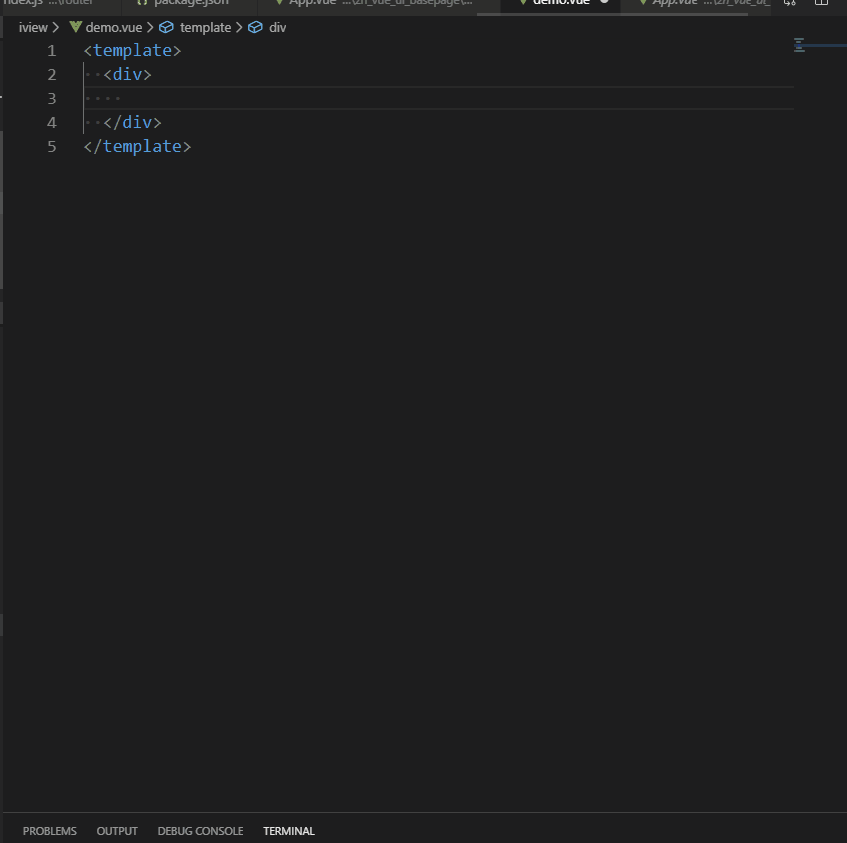

# 卡片组件片段 #
### 动效演示 ##

:::demo

```html
<template>
  <div id="app">     
      <zn-card :cardTitle="cardTitle"
               :titleStyle="titleStyle"
               :cardBordered="cardBordered"
               :disHover="disHover"
               :cardStyle="cardStyle"
               :shadow="shadow">
        <!-- 标题图标 -->
         <Icon type="ios-film-outline" slot="titleIcon"></Icon>
        <!-- 在卡片右上角添加额外操作 -->
        <a href="#" slot="extra">
            <Icon type="ios-loop-strong"></Icon>
            换一换
        </a>
        <div slot="content" class="content">
            内容
        </div>
      </zn-card>
  </div>
</template>

<script>
export default {
  name: 'app',
  data () {
    return {
     cardTitle:'电影经典',                         //卡片标题
     titleStyle:{                                 //卡片标题样式
       textAlign:'left'
     },
     cardBordered:true,                           //卡片边框(true:显示边框)   
     disHover:false,                              //禁用鼠标悬停显示阴影的效果（true:禁用）
     cardStyle:{                                  //卡片样式 
       width:'300px',margin:'20px auto',height:'500px'
     },
     shadow:false                                //显示卡片阴影 
                                                 //使用该属性后，bordered和dis-hover将无效，建议在灰色背景下使用 
    }
  },
  methods: {
    
  }
}
</script>

```
:::