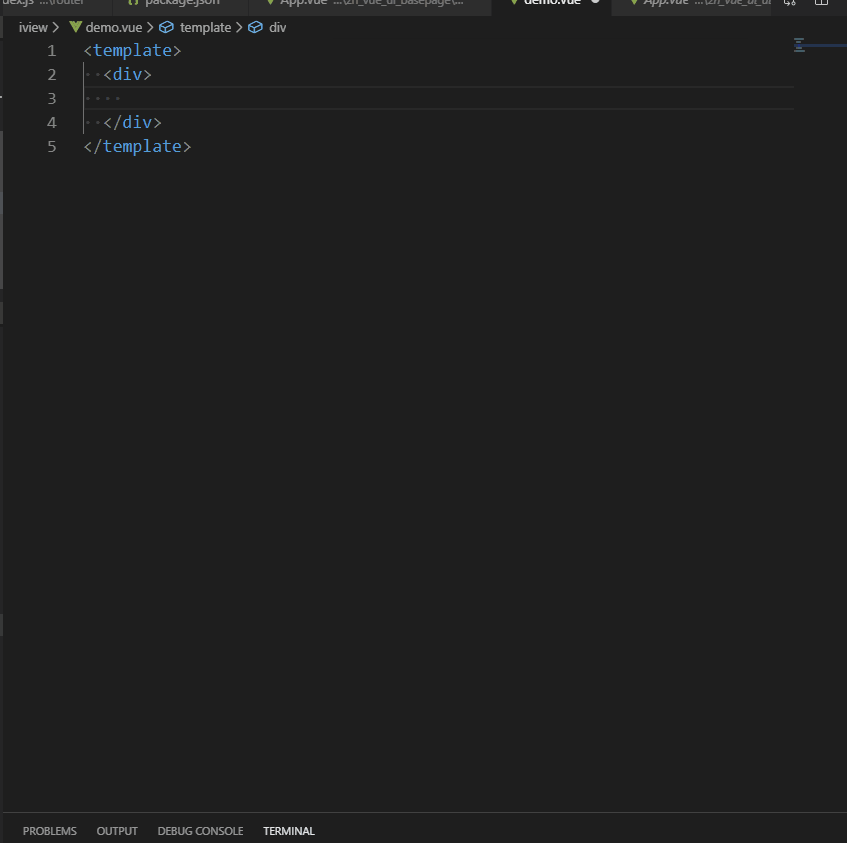

# 弹框组件片段 #
### 动效演示 ##

:::demo

```html
<template lang="bash">
<div
    id="app"
    class="znlhApp"
>
    <!---------------- 弹窗一 ---------------->
    <Button
        type="primary"
        @click="dialog1 = true"
    >普通弹窗</Button>

    <zn-dialog
        :show="dialog1"
        ref="dialog1"
        @confirm="confirm('dialog1')"
        @cancel="cancel('dialog1')"
        @iconClose="iconClose('dialog1')"
    >
        <p>这是一个普通的弹窗</p>
    </zn-dialog>

    <Divider />

    <!---------------- 弹窗二 ---------------->
    <Button
        type="primary"
        @click="dialog2 = true"
    >隐藏左上角关闭按钮</Button>

    <zn-dialog
        ref="dialog2"
        :show="dialog2"
        :close-icon-show="true"
        @confirm="confirm('dialog2')"
        @cancel="cancel('dialog2')"
        @iconClose="iconClose('dialog2')"
    >
        <p>隐藏左上角关闭按钮</p>
    </zn-dialog>

    <Divider />

    <!---------------- 弹窗三 ---------------->
    <Button
        type="primary"
        @click="dialog3 = true"
    >隐藏底部按钮</Button>

    <zn-dialog
        ref="dialog3"
        :show="dialog3"
        :footBtnHide="true"
        @confirm="confirm('dialog3')"
        @cancel="cancel('dialog3')"
        @iconClose="iconClose('dialog3')"
    >
        <p>隐藏底部按钮</p>
    </zn-dialog>

    <Divider />

    <!---------------- 弹窗四 ---------------->
    <Button
        type="primary"
        @click="dialog4 = true"
    >定义底部按钮等</Button>

    <zn-dialog
        ref="dialog4"
        :show="dialog4"
        confirmText="sure"
        cancelText="cancel"
        @confirm="confirm('dialog4')"
        @cancel="cancel('dialog4')"
        @iconClose="iconClose('dialog4')"
    >
        <p>定义 确认 取消 按钮名称及显示</p>
    </zn-dialog>

    <Divider />

    <!---------------- 弹窗五 ---------------->
    <Button
        type="primary"
        @click="dialog5 = true"
    >定义弹窗位置</Button>

    <zn-dialog
        ref="dialog5"
        :show="dialog5"
        modal-class-name="vertical-center-modal"
        @confirm="confirm('dialog5')"
        @cancel="cancel('dialog5')"
        @iconClose="iconClose('dialog5')"
    >

        <p>定义弹窗传值居中，通过class类 样式控制</p>
    </zn-dialog>

    <Divider />

    <!---------------- 弹窗六 ---------------->
    <Button
        type="primary"
        @click="dialog6 = true"
    >自定义底部按钮</Button>

    <zn-dialog
        ref="dialog6"
        :show="dialog6"
        @iconClose="iconClose('dialog6')"
    >
        <p>自定义底部按钮</p>
        <div
            class="foo-btn-box"
            slot="zn-footer-btn"
        >
            <Button type="info">Info</Button>
            <Button type="success">Success</Button>
            <Button type="warning">Warning</Button>
            <Button type="error">Error</Button>
        </div>
    </zn-dialog>

    <Divider />

    <!---------------- 弹窗七结合表单 ---------------->
    <Button
        type="primary"
        @click="dialog7 = true"
    >结合表单例子</Button>

    <zn-dialog
        ref="dialog7"
        :show="dialog7"
        cancelText="重置"
        @iconClose="iconClose('dialog7','formValidate')"
        @confirm="handleSubmit('dialog7','formValidate')"
        @cancel="handleReset('dialog7','formValidate')"
    >
        <Form
            ref="formValidate"
            :model="formValidate"
            :rules="ruleValidate"
            :label-width="80"
        >
            <FormItem
                label="Name"
                prop="name"
            >
                <Input
                    v-model="formValidate.name"
                    placeholder="Enter your name"
                ></Input>
            </FormItem>
            <FormItem
                label="E-mail"
                prop="mail"
            >
                <Input
                    v-model="formValidate.mail"
                    placeholder="Enter your e-mail"
                ></Input>
            </FormItem>
            <FormItem
                label="City"
                prop="city"
            >
                <Select
                    v-model="formValidate.city"
                    placeholder="Select your city"
                >
                    <Option value="beijing">New York</Option>
                    <Option value="shanghai">London</Option>
                    <Option value="shenzhen">Sydney</Option>
                </Select>
            </FormItem>
            <FormItem label="Date">
                <Row>
                    <Col span="11">
                    <FormItem prop="date">
                        <DatePicker
                            type="date"
                            placeholder="Select date"
                            v-model="formValidate.date"
                        ></DatePicker>
                    </FormItem>
                    </Col>
                    <Col
                        span="2"
                        style="text-align: center"
                    >-</Col>
                    <Col span="11">
                    <FormItem prop="time">
                        <TimePicker
                            type="time"
                            placeholder="Select time"
                            v-model="formValidate.time"
                        ></TimePicker>
                    </FormItem>
                    </Col>
                </Row>
            </FormItem>
            <FormItem
                label="Gender"
                prop="gender"
            >
                <RadioGroup v-model="formValidate.gender">
                    <Radio label="male">Male</Radio>
                    <Radio label="female">Female</Radio>
                </RadioGroup>
            </FormItem>
            <FormItem
                label="Hobby"
                prop="interest"
            >
                <CheckboxGroup v-model="formValidate.interest">
                    <Checkbox label="Eat"></Checkbox>
                    <Checkbox label="Sleep"></Checkbox>
                    <Checkbox label="Run"></Checkbox>
                    <Checkbox label="Movie"></Checkbox>
                </CheckboxGroup>
            </FormItem>
            <FormItem
                label="Desc"
                prop="desc"
            >
                <Input
                    v-model="formValidate.desc"
                    type="textarea"
                    :autosize="{minRows: 2,maxRows: 5}"
                    placeholder="Enter something..."
                ></Input>
            </FormItem>
        </Form>
    </zn-dialog>

    <Divider />

</div>
</template>

<script>
export default {
  name: "app",
  data() {
    return {
      dialog1: false,
      dialog2: false,
      dialog3: false,
      dialog4: false,
      dialog5: false,
      dialog6: false,
      dialog7: false,

      formValidate: {
        name: "",
        mail: "",
        city: "",
        gender: "",
        interest: [],
        date: "",
        time: "",
        desc: ""
      },
      ruleValidate: {
        name: [
          {
            required: true,
            message: "The name cannot be empty",
            trigger: "blur"
          }
        ],
        mail: [
          {
            required: true,
            message: "Mailbox cannot be empty",
            trigger: "blur"
          },
          {
            type: "email",
            message: "Incorrect email format",
            trigger: "blur"
          }
        ],
        city: [
          {
            required: true,
            message: "Please select the city",
            trigger: "change"
          }
        ],
        gender: [
          {
            required: true,
            message: "Please select gender",
            trigger: "change"
          }
        ],
        interest: [
          {
            required: true,
            type: "array",
            min: 1,
            message: "Choose at least one hobby",
            trigger: "change"
          },
          {
            type: "array",
            max: 2,
            message: "Choose two hobbies at best",
            trigger: "change"
          }
        ],
        date: [
          {
            required: true,
            type: "date",
            message: "Please select the date",
            trigger: "change"
          }
        ],
        time: [
          {
            required: true,
            type: "string",
            message: "Please select time",
            trigger: "change"
          }
        ],
        desc: [
          {
            required: true,
            message: "Please enter a personal introduction",
            trigger: "blur"
          },
          {
            type: "string",
            min: 20,
            message: "Introduce no less than 20 words",
            trigger: "blur"
          }
        ]
      }
    };
  },
  methods: {
    confirm(vmodel) {
      this[vmodel] = false;
    },
    cancel(vmodel) {
      this[vmodel] = false;
    },
    iconClose(vmodel, name) {
      if (name) {
        this.$refs[name].resetFields();
      }
      this[vmodel] = false;
    },

    handleSubmit(vmodel, name) {
      this.$refs[name].validate(valid => {
        if (valid) {
          this.$Message.success("Success!");
          this[vmodel] = false;
        } else {
          this.$Message.error("Fail!");
        }
      });
    },
    handleReset(vmodel, name) {
      this.$refs[name].resetFields();
    }
  }
};
</script>

```
:::