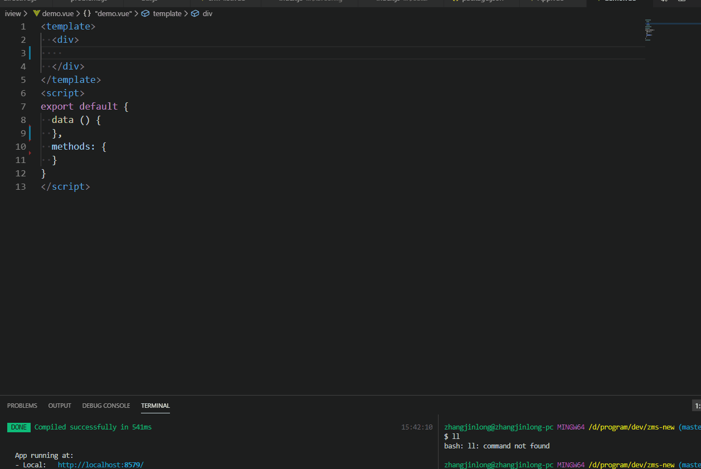

# tab组件片段 #
### 动效演示 ##



```html
<template>
  <div>
    <!-- 普通 -->
    <el-select placeholder="请选择" v-model="model"  @change="handleChange">
    <el-option v-for="(item, index) in arr" :key="index" :label="item.key" :value="item.value"></el-option>
    </el-select>
    <!-- 对象 -->
    <el-select placeholder="请选择" v-model="model"  @change="handleChange" value-key="key">
    <el-option v-for="(item, index) in arr" :key="index" :label="item.key" :value="item"></el-option>
    </el-select>
  </div>
</template>
<script>
export default {
  data () {
  },
  methods: {
    handleChange(val) {
      // TODO
    }
  }
}
</script>
```