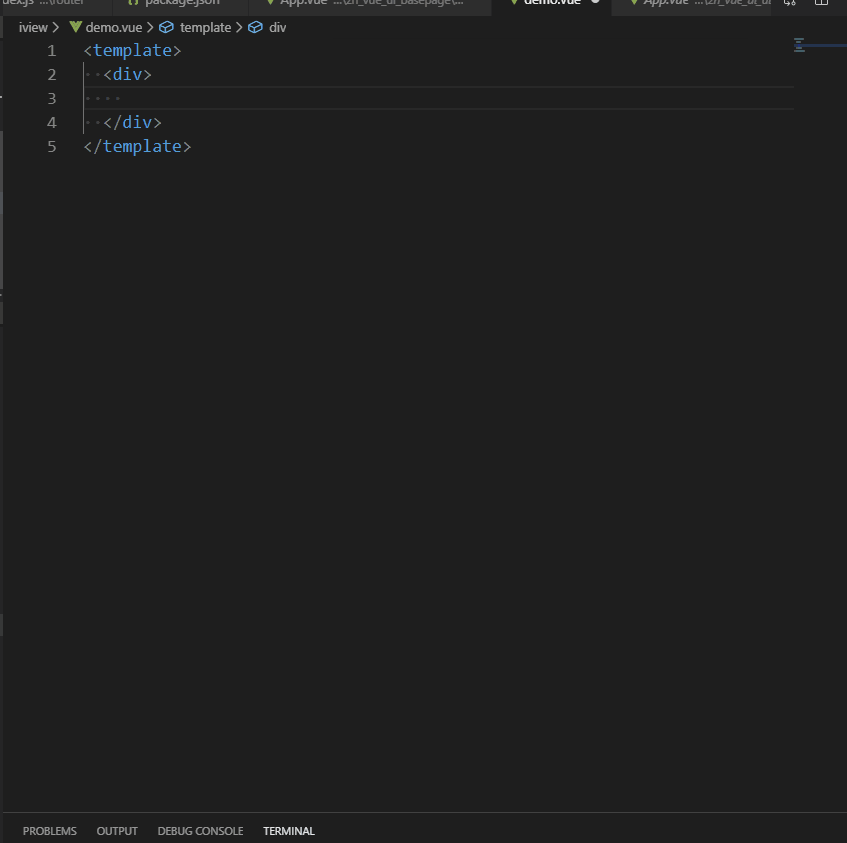

# 异常组件片段 #
### 动效演示 ##


:::demo

```html
<template>
  <div class="znlhApp">
    <div class="content">
      <zn-errorpage :statuCode="statuCode" :statuDesc="statuDesc" :imgWidth="imgWidth" :isJumping="isJumping" :count="5" :router="router" :isShowCount="isShowCount"></zn-errorpage>
    </div>     
  </div>
</template>

<script>
export default {
  name: 'znlhApp',
  data () {
    return {
      statuCode: 500,
      statuDesc:'服务器繁忙',
      imgWidth: 500,
      isJumping: false,
      count: 5,
      router:'/zn_vue_ui_errorpage',
      isShowCount: true
    }
  },
  mounted () {},
  methods: {
  }
}
</script>

```
:::
### 99999没有数据

:::demo

```html
<template>
  <div class="znlhApp">
    <div class="content">
      <zn-errorpage status="99999" dataDesc='数据不见了'></zn-errorpage>
    </div>
  </div>
</template>

<script>
export default {
  name: 'znlhApp',
  data () {
    return {
    }
  },
  mounted () {},
  methods: {
  }
}
</script>

```
:::