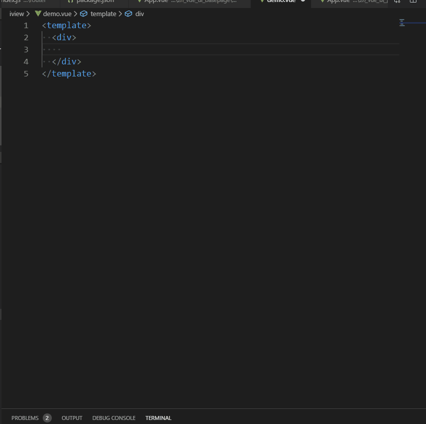

# 表单组件片段 #
### 动效演示 ##


:::demo

```html
<template>
    <div id="form">
        <Button class="addItem" type="primary" @click="visible = true">打开表单弹框</Button>
        <Modal v-model="visible" title="form组件演示" width="800">
            <zn-base-form
                :config="formConfig"
                :submit.sync="submit"
                :resetOnClose="resetOnClose"
                :modalVisible.sync="visible"
                :defaultValues="defaultValues"
                :disabledItems="disabledItems"
                @submit="handleSubmit">
                <div class="hello-world" slot="extra1">
                    <Rate v-model="rate"/>
                </div>
                <div class="hello-world" slot="extra2">
                    <i-circle :percent="80">
                        <span class="demo-Circle-inner" style="font-size:24px">80%</span>
                    </i-circle>
                </div>
            </zn-base-form>
            <span class="dialog-footer" slot="footer">
                <Button @click="visible = false">取消</Button>
                <Button @click="submit = true" type="primary" :loading="loading">确定</Button>
            </span>
        </Modal>
    </div>
</template>

<script>
const selectList = [{
    'id': 305,
    'type': 'crm_cust_info_source',
    'label': '上门拜访',
    'value': '1',
    'sort': 1,
    'createCode': null,
    'createDate': null,
    'updateCode': null,
    'updateDate': null,
    'delFlag': 0
}, {
    'id': 306,
    'type': 'crm_cust_info_source',
    'label': '百度搜索',
    'value': '2',
    'sort': 2,
    'createCode': null,
    'createDate': null,
    'updateCode': null,
    'updateDate': null,
    'delFlag': 0
}, {
    'id': 307,
    'type': 'crm_cust_info_source',
    'label': '360搜索',
    'value': '3',
    'sort': 3,
    'createCode': null,
    'createDate': null,
    'updateCode': null,
    'updateDate': null,
    'delFlag': 0
}, {
    'id': 308,
    'type': 'crm_cust_info_source',
    'label': '58',
    'value': '4',
    'sort': 4,
    'createCode': null,
    'createDate': null,
    'updateCode': null,
    'updateDate': null,
    'delFlag': 0
}, {
    'id': 309,
    'type': 'crm_cust_info_source',
    'label': '车体广告',
    'value': '5',
    'sort': 5,
    'createCode': null,
    'createDate': null,
    'updateCode': null,
    'updateDate': null,
    'delFlag': 0
}, {
    'id': 310,
    'type': 'crm_cust_info_source',
    'label': '老客户介绍',
    'value': '6',
    'sort': 6,
    'createCode': null,
    'createDate': null,
    'updateCode': null,
    'updateDate': null,
    'delFlag': 0
}, {
    'id': 311,
    'type': 'crm_cust_info_source',
    'label': '朋友介绍',
    'value': '7',
    'sort': 7,
    'createCode': null,
    'createDate': null,
    'updateCode': null,
    'updateDate': null,
    'delFlag': 0
}, {
    'id': 312,
    'type': 'crm_cust_info_source',
    'label': '线下物料包',
    'value': '8',
    'sort': 8,
    'createCode': null,
    'createDate': null,
    'updateCode': null,
    'updateDate': null,
    'delFlag': 0
}, {
    'id': 313,
    'type': 'crm_cust_info_source',
    'label': '市场活动',
    'value': '9',
    'sort': 9,
    'createCode': null,
    'createDate': null,
    'updateCode': null,
    'updateDate': null,
    'delFlag': 0
}, {
    'id': 314,
    'type': 'crm_cust_info_source',
    'label': '其他',
    'value': '10',
    'sort': 10,
    'createCode': null,
    'createDate': null,
    'updateCode': null,
    'updateDate': null,
    'delFlag': 0
}]

const formConfig = {
    grid:{
        col:2,
        gutter:40
    },
    items: [
        {
            label: '手机号',
            type: 'input',
            placeholder: '请输入手机号码',
            propName: 'phone',
            required: true,
            validate: {
                validator (rule, value, callback) {
                    let idRegExp = /^1[3456789]\d{9}$/
                    if (!value) {
                        callback(new Error('请输入手机号码'))
                    } else if (!idRegExp.test(value)) {
                        callback(new Error('手机号码不正确'))
                    } else {
                        callback()
                    }
                }
            }
        },
        {
            label: '数量',
            type: 'inputNumber',
            propName: 'mount'
        },
        {
            label: '客户昵称',
            type: 'input',
            placeholder: '请输入客户昵称',
            propName: 'clientName'
        },
        {
            label: '行业',
            type: 'select',
            placeholder: '请选择行业',
            list: selectList,
            propName: 'industry'
        },
        {
            label: '日期',
            type: 'date',//date or daterange
            format: 'yyyy/MM/dd',//日期展示格式
            placeholder: '请选择日期',
            propName: 'date'
        },
        {
            label: '时间',
            type: 'time',
            placeholder: '请选择时间',
            propName: 'time'
        },
        {
            label: '行业Radio',
            type: 'radio',
            propName: 'industry2',
            list: selectList
        },
        {
            label: '行业Checkbox',
            type: 'checkbox',
            propName: 'industry3',
            list: selectList
        },
        {
            label: '开关',
            type: 'switch',
            propName: 'switch',
            openText: 'on',
            closeText: 'off',
        },
        {
            label: '滑块',
            type: 'slider',
            propName: 'slider'
        },
        {
            label: '备注',
            type: 'textarea',
            placeholder: '不多于200字',
            propName: 'remark'
        },
        {
            label: '纯文字',
            type: 'text',
            text: '南京市路口国际机场',
            propName: 'address'
        },
        {
            label:'扩展插槽1',
            type:'slot',
            propName:'extra1',
            slotName:'extra1'
        },
        {
            label:'扩展插槽2',
            type:'slot',
            propName:'extra2',
            slotName:'extra2'
        }
    ]//表单元素
}

export default {
  data() {
    return {
      visible: false, //对话框是否可见
      submit: false,
      resetOnClose: true, //对话框关闭时重置表单
      loading: false,
      rate: 1,
      formConfig,
      defaultValues: {}, //表单默认值，用来回填表单
      disabledItems:[]//禁用的项目
    }
  },
  methods: {
    /**
     * @Desc: 表单提交事件
     * @Param: param,表单回传参数
     * @Param: allValid,所有表单元素都符合校验规则
     * @return:
     */
    handleSubmit(param, allValid) {
      this.submit = false
      this.loading = true
      //模拟异步请求接口
      if (allValid) {
        setTimeout(() => {
          //异步接口回包，关闭加载状态
          this.loading = false
          this.visible = false
        }, 1000)
      } else {
        //元素没有全部验证通过，关闭加载状态
        this.loading = false
      }
    }
  }
}
</script>

```
:::