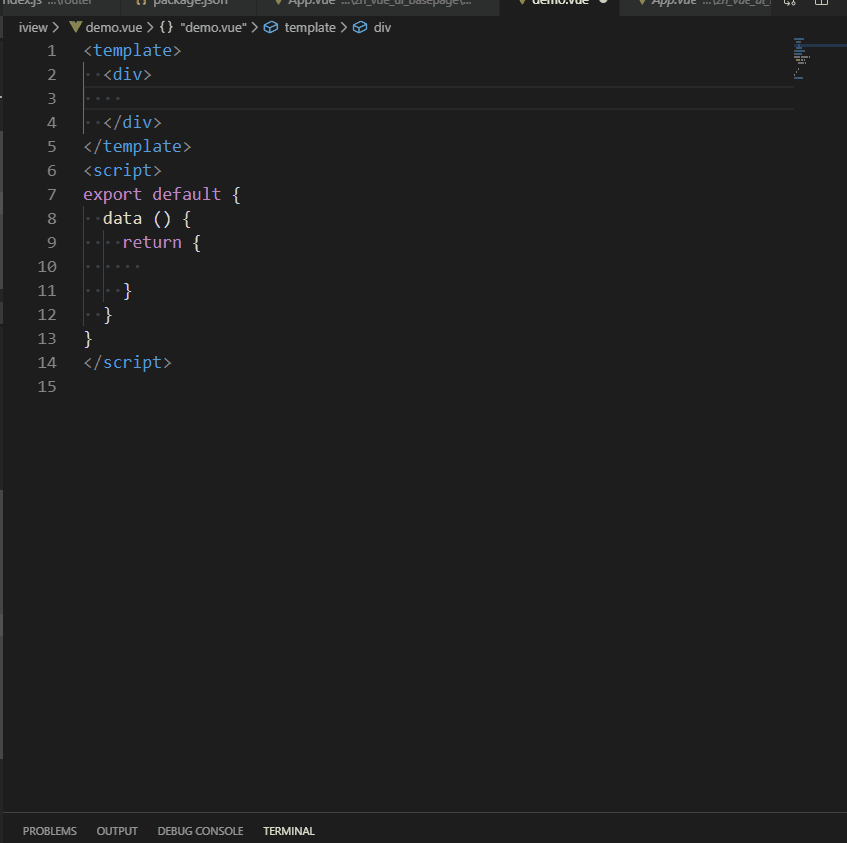

# tab组件片段 #
### 动效演示 ##


:::demo

```html
<template>
  <div id="app" class="znlhApp">
        <zn-tabs @znTabsClick="znTabsClick" v-model="activeTab">
            <TabPane v-for="(tab,index) in tabs" :key="index" :name="tab.status" :label="tab.name">
            <span>{{tab.name}}</span>
            </TabPane>
        </zn-tabs>
  </div>
</template>

<script>
export default {
  data () {
    return {
        activeTab: '1', // 默认选项卡
        tabs: [
            {
                status: '1',
                name: '我关注的'
            },
            {
                status: '2',
                name: '我提交的'
            },
            {
                status: '0',
                name: '全部'
            }
        ]
    }
  },
  mounted () {},
  methods: {
    /**
     * tab切换
     */
    znTabsClick (name) {
       // eslint-disable-next-line no-console
       console.log(name, 1000)
    }
  }
}
</script>
<!-- <style lang='less'>
.zn-layout {
    color: red;
}
</style> -->
```
:::